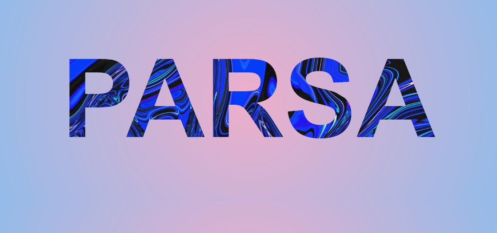
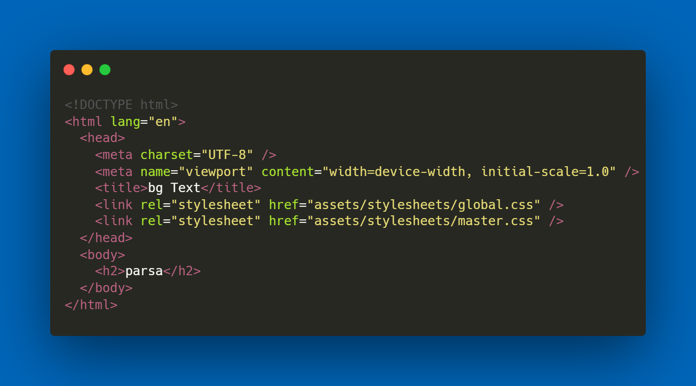
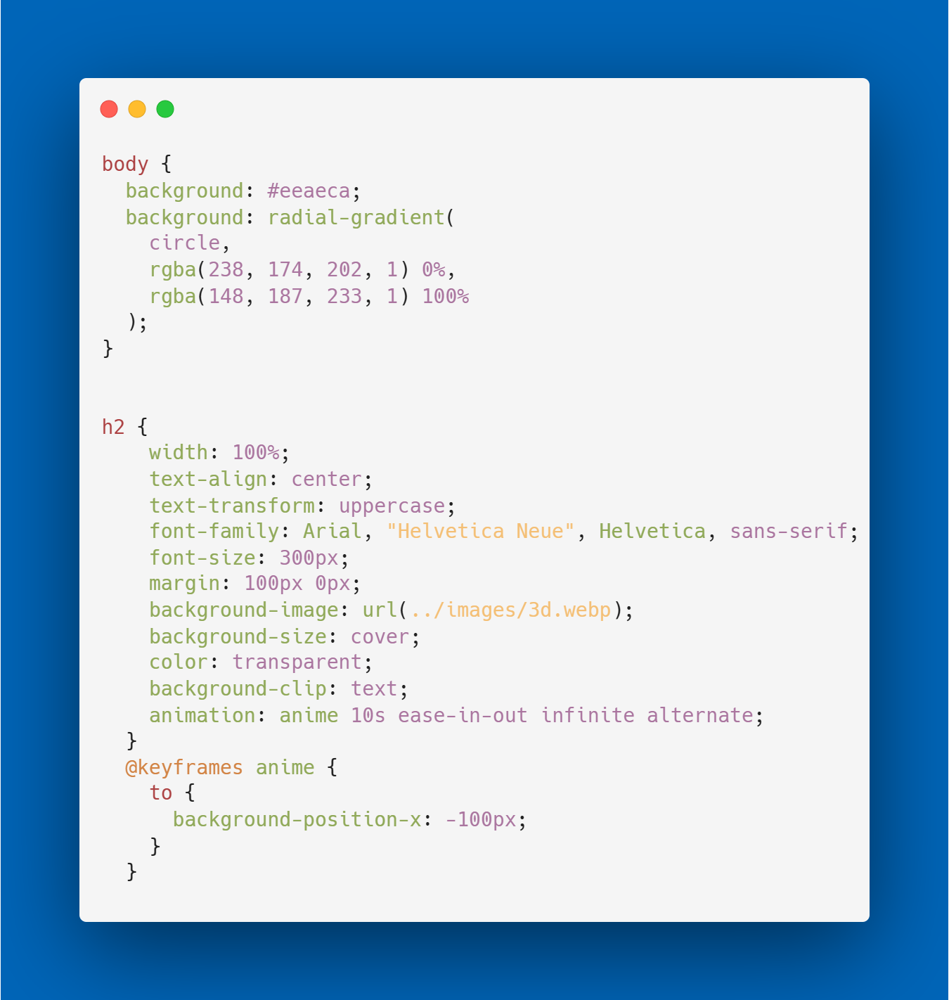

# Frontend Project – 3D Text Background Animation by Parsa Dehghan Pour Farashah

An eye-catching text animation built with **pure HTML and CSS**, featuring a moving 3D-style background that brings depth and motion to static text — all without using JavaScript.

---

## 🎨 What Is This Project?

**3D Text Background Animation** is a creative frontend experiment where the background image shifts dynamically to create the illusion of 3D motion behind the text.  
It’s a clean, simple, and elegant showcase of how CSS transforms and animations can elevate static typography.

> Fully built with HTML + CSS. No JavaScript. No libraries. No frameworks.

---

## 📅 Created On  
**July 18, 2025**

## 👨‍💻 Developed By  
Parsa Dehghan Pour Farashah

🔧 **Project Mentor**: [@parsa_ghorbanian_web](https://www.instagram.com/parsa_ghorbanian_web)

## 🛠️ Technologies Used  
- HTML  
- CSS (background animation, transform, z-index)

## ❌ Responsiveness  
This project is **not responsive** and best viewed on desktop.

## 🎯 Role  
Frontend Developer

## 🔗 [🌐 Live Demo – View the Animation](https://parsa-farshah.github.io/3D-Text-Background-Animation/)

## 📬 Contact  
- Instagram: [@parsa_dehghanpour_dv](https://www.instagram.com/parsa_dehghanpour_dv)  
- LinkedIn: [Parsa Dehghan Pour Farashah](https://www.linkedin.com/in/parsa-dehghan-pour-farashah-85ab04250)  
- GitHub: [parsa-farshah](https://github.com/parsa-farshah)  
- Email: parsafarashah2002@gmail.com

---

## 📄 HTML & CSS Code Preview

Here’s a quick visual of the main HTML and CSS used in this project:

### 🔤 HTML Snippet

### 🎨 CSS Snippet

